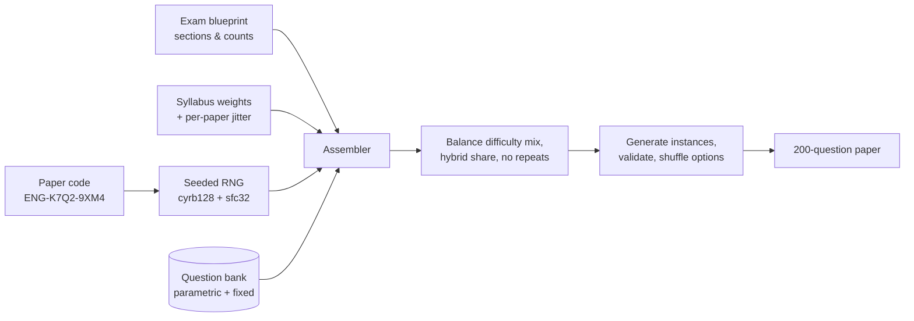

<div align="center">

# NET CBT Simulator

**A high-fidelity, open-source simulator of the NUST Entry Test (NET) computer-based test, with a hybrid
dynamic question engine that generates unique, reproducible full-length papers.**

[](https://github.com/Fahad0141/net-cbt-simulator/actions/workflows/ci.yml)
[](https://github.com/Fahad0141/net-cbt-simulator/actions/workflows/deploy.yml)
[](LICENSE)

</div>

> **Unofficial.** This project is an independent practice tool. It is not affiliated with, endorsed by, or
> connected to the National University of Sciences & Technology (NUST). It uses no NUST logos or official
> question material. Always check official announcements on the
> [NUST admissions website](https://ugadmissions.nust.edu.pk/).


<details>
<summary><strong>More screenshots</strong></summary>

| Paper generator                                          | Score report                                               |
| -------------------------------------------------------- | ---------------------------------------------------------- |
|  |                |
| **Answer review with worked solutions**                  | **Printable paper with answer key**                        |
|             |    |
| **Question bank browser**                                | **Dashboard on a phone**                                   |
|      |  |

</details>

## Why

NET candidates usually practise on PDFs or generic quiz apps, then meet an unfamiliar computer-based terminal on
test day. The terminal has a **Save** button that must be pressed, a minutes-only clock, and section navigation.
Commercial mock tests also repeat the same questions and often use outdated patterns. This project fixes both:

- **The terminal behaves like the real one.** It is recreated from NUST's official CBT sample and candidate reports.
- **Every paper is new.** Nearly 2,900 question templates (about 1,300 parametric generators and 1,600 fixed
  past-paper-style questions) are assembled to match the current NET blueprint. Each paper has a short code, so you
  can share it, print it, or retake it exactly.

## Features

### Faithful CBT terminal

- Login box, then the instructions, then the exam screen laid out like the official _VUTES / "NUST e-Test"_
  client: section and test header, **Question No : x of 200**, **Marks: 1**, photograph panel, a question tab,
  and four unlabelled radio options.
- **Answers count only when you press Save.** If you leave a question without saving, the selection is
  discarded. **Review** (mark for review) becomes available after you save.
- **Next / Prev** move continuously across sections. **Next Section / Prev Section** and **First / Last** are
  also available, plus the attempted counter and the **All / Attempted / Unattempted / Reviewable** jump lists
  that the live exam provides.
- A minutes-remaining green clock with the start time, and a 15-minute warning. The paper submits itself when
  time runs out.
- A pacing cue: the screen dims after the average time per question (about 54 s), as candidates report from the
  real exam.
- **"Click here to FINISH Your Test"** uses the real confirmation wording. In exam mode no score is shown on the
  terminal, just like the real NET; the score appears in a separate simulator panel.
- Crash-proof: state is saved after every action, so a refresh or closed tab resumes where you were.

### Hybrid dynamic question engine

- **Parametric templates** regenerate every time with new values and mistake-based distractors (for example a
  forgotten factor of ½, a sign slip, or the wrong formula).
- **Fixed past-paper-style questions** cover recurring NET themes. All are written for this project.
- **Blueprint-accurate assembly.** It uses the official subject split, weighted chapter coverage with variation
  from paper to paper, a calibrated easy/medium/hard mix, and a tunable hybrid ratio.
- **Reproducible paper codes** such as `ENG-K7Q2-9XM4`: the same code and bank version always give the same paper.
- KaTeX math, mhchem chemistry, SVG figures for design aptitude, code blocks for computer science, and reading
  passages.

### Every NET paper

| Paper (current, since 2025)            | Sections (200 MCQs · 180 min · no negative marking) |
| -------------------------------------- | --------------------------------------------------- |
| NET Engineering                        | Mathematics 100 · Physics 60 · English 40           |
| NET Applied Sciences                   | Biology 100 · Chemistry 60 · English 40             |
| NET Business Studies & Social Sciences | Quantitative Mathematics 100 · English 100          |
| NET Architecture                       | Design Aptitude 100 · Mathematics 60 · English 40   |
| NET Natural Sciences                   | Mathematics 100 · English 100                       |

Legacy (pre-2025) patterns with Chemistry, Computer Science and Intelligence are included for extra practice,
together with a **custom test builder** where you pick subjects, chapters, question counts and duration.
Sources are in [docs/EXAM_PATTERN.md](docs/EXAM_PATTERN.md).

### Study tools

- **Exam mode** gives real conditions. **Practice mode** adds auto-save, pause, a question navigator, keyboard
  shortcuts and instant feedback.
- **Score report**: subject, chapter and difficulty breakdowns, time analysis, the weakest chapters with
  one-click practice, and a NUST aggregate estimator (75% NET, 15% HSSC, 10% SSC).
- **Review**: question-by-question review with worked solutions, filters, and a "report a problem" link.
- **Analytics**: score trend, chapter mastery and pacing across all your attempts.
- **Printable papers**: an A4 full-length paper with an OMR answer sheet, answer key and optional solutions
  (save it as PDF). There is also a command-line generator.
- **Question-bank browser** with live previews of every template.
- Runs entirely in the browser: no account and no server. History is stored locally and can be exported or
  imported as JSON. It also has light and dark themes, works at phone widths, and is keyboard accessible.
- **Android app**: the same simulator as an installable APK that works offline from the first launch, with
  Android printing and sharing. See [Android app](#android-app).
- **Windows desktop app**: a `.exe` installer for Windows 10/11 that works offline, keeps your history on
  the computer and prints with the Windows print dialog. See [Windows desktop app](#windows-desktop-app).

## Quick start

Requires **Node.js 20+**.

```bash
npm install
npm run dev          # http://localhost:5173
```

| Script                                | What it does                                                                                        |
| ------------------------------------- | --------------------------------------------------------------------------------------------------- |
| `npm run dev`                         | Start the dev server                                                                                |
| `npm run build`                       | Type-check and build the static site into `dist/`                                                   |
| `npm run preview`                     | Serve the production build                                                                          |
| `npm test`                            | Run all unit, component and question-bank tests                                                     |
| `npm run check`                       | Type-check, lint and test                                                                           |
| `npm run e2e`                         | Playwright smoke tests (run `npm run build` first)                                                  |
| `npm run paper -- --type engineering` | Print a full-length paper as Markdown (`--code`, `--seed`, `--format json`, `--solutions`, `--out`) |
| `npm run sample -- physics/waves 3`   | Print generated instances of templates                                                              |
| `npm run bank:report`                 | Summarise the question bank into `docs/BANK.md`                                                     |
| `npm run android:sync`                | Build the site and copy it into the Android project (see [Android app](#android-app))               |
| `npm run desktop:dist`                | Build the Windows installer into `dist-desktop/` (see [Windows desktop app](#windows-desktop-app))  |

### Deploying

The build is a static site with relative asset paths and hash routing, so it runs on any static host. The
included workflow `.github/workflows/deploy.yml` publishes it to **GitHub Pages** on every push to `main`
(enable Pages → "GitHub Actions" in the repository settings). Builds take the GitHub links from
`VITE_REPO_URL`, which the workflows set to the repository they run in, so a fork links to itself. The live site is
<https://fahad0141.github.io/net-cbt-simulator/>.

## Android app

The simulator is also an Android app (Android 6.0 or later), built with [Capacitor](https://capacitorjs.com/)
from the same code. Everything is bundled in the APK, so it works offline from the first launch. Printing
uses Android's print dialog (including Save as PDF), history export opens the share sheet, and the back
button never leaves a running test, just like the real terminal.

- **Install:** download the APK from a GitHub release (the `.github/workflows/android.yml` workflow attaches
  it to version tags), copy it to the phone and open it.
- **Build it yourself:** `npm run android:sync`, then `./gradlew assembleRelease` in `android/` (JDK 21 and the
  Android SDK required).

See [docs/ANDROID.md](docs/ANDROID.md) for installing, building, release signing and the CI setup. You can
also install the deployed website from Chrome (**Install app**); it works offline after the first visit.

## Windows desktop app

The simulator also comes as a Windows desktop app (Windows 10 or 11, 64-bit), built with
[Electron](https://www.electronjs.org/) from the same code. Everything is bundled in the installer, so it works
offline, your history stays in your Windows profile, the printable paper uses the Windows print dialog
(including **Microsoft Print to PDF**), and F11 gives the CBT terminal the whole screen.

- **Install:** run `NET-CBT-Simulator-Setup-<version>.exe` from a GitHub release (the
  `.github/workflows/desktop.yml` workflow attaches it to version tags). It installs for your user only, without
  administrator rights. The installer is not code-signed, so Windows SmartScreen may say it "protected your
  PC": choose **More info**, then **Run anyway**.
- **Build it yourself:** `npm run desktop:install` once, then `npm run desktop:dist`. The installer is written
  to `dist-desktop/`.

The desktop app lives in its own package (`desktop/`, with its own dependencies), so the website build and
the GitHub Pages deploy are unchanged by it. See [docs/DESKTOP.md](docs/DESKTOP.md) for details.

## How a paper is generated



1. The **paper code** encodes the exam type and a seed. The seeded RNG is bit-for-bit deterministic on every
   JavaScript engine.
2. Each section's questions are split across chapters by syllabus weight, with jitter so papers differ the way
   real ones do.
3. Templates are drawn with pressure towards the target difficulty mix and the target dynamic/fixed share.
   Fixed questions never repeat within a paper.
4. Every generated instance is validated: four distinct options, balanced markup, no `NaN`/`undefined` leaks.
   Options are shuffled per paper.

See [docs/ARCHITECTURE.md](docs/ARCHITECTURE.md) for details.

## Question bank

The bank lives in `src/bank/<subject>/<chapter>.ts`, and a summary is generated in [docs/BANK.md](docs/BANK.md).
It holds 2,856 templates across 110 syllabus chapters of nine subjects.

| Subject            | Templates | Parametric | Chapters |
| ------------------ | --------: | ---------: | -------: |
| Mathematics        |       486 |        310 |       21 |
| Physics            |       492 |        202 |       21 |
| Chemistry          |       430 |        129 |       23 |
| Biology            |       382 |        109 |       13 |
| English            |       361 |         89 |        6 |
| Design Aptitude    |       245 |        142 |        5 |
| Computer Science   |       193 |         87 |       11 |
| Quantitative Maths |       190 |        146 |        6 |
| Intelligence       |        77 |         62 |        4 |

A test-suite quality gate generates many instances of every template. It checks structure, distinct options,
determinism, variety, interpolation leaks, rounded values shown in stems and KaTeX rendering. Every chapter was
also reviewed adversarially: a reviewer solved sampled instances before looking at the key and fixed what they
found. Many chapters had a second independent review, and a final seeded random spot-check of 162 templates across
all subjects found no wrong answer keys.

Found a wrong answer? Open an issue with the paper code and question number. Codes are reproducible, so the
exact question can be regenerated.

## Contributing

Contributions are welcome, especially new questions and corrections. Read
[CONTRIBUTING.md](CONTRIBUTING.md) and the [question authoring guide](docs/QUESTION_AUTHORING.md).

## Project structure

```
src/
  engine/        seeded RNG, template API, rich text, validation, paper assembly (pure TypeScript)
  bank/          question templates by subject and chapter
  config/        exam patterns and syllabus weights
  exam/          session state machine, scoring, persistence, paper service
  ui/cbt/        the faithful CBT terminal
  ui/pages/      dashboard, paper generator, results, review, analytics, print, bank browser
  platform/      Android and Windows app integration (printing, sharing, back button, wording)
android/         the Capacitor Android project
desktop/         the Electron Windows desktop app and its installer (separate npm package)
assets/          sources of the Android icon and splash screen
scripts/         CLI tools (paper generator, sampler, bank report, Android assets, Android and desktop smoke tests)
docs/            exam pattern sources, architecture, authoring guide, Android and desktop guides, bank report
```

## License

[MIT](LICENSE). Questions are original works by the contributors and are released under the same license.
