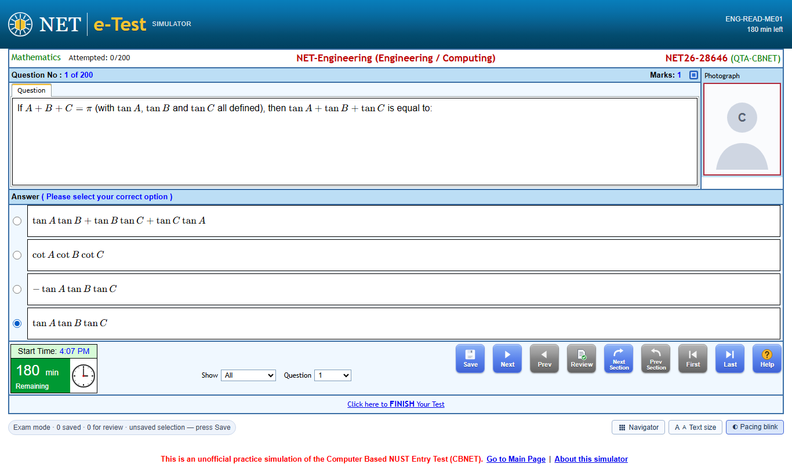
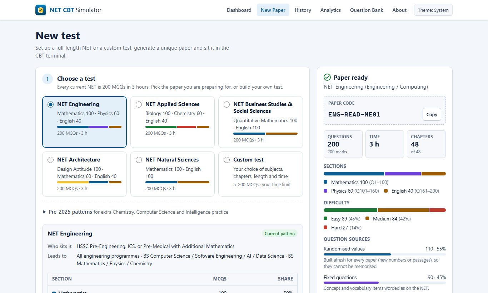
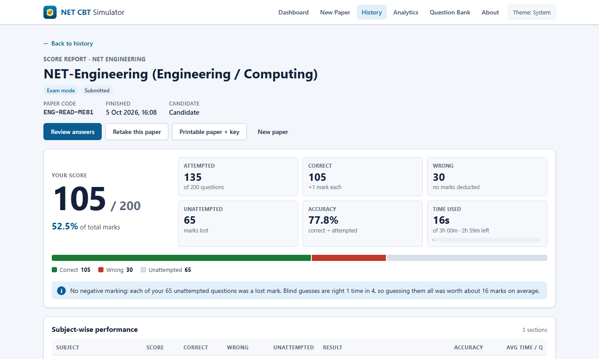
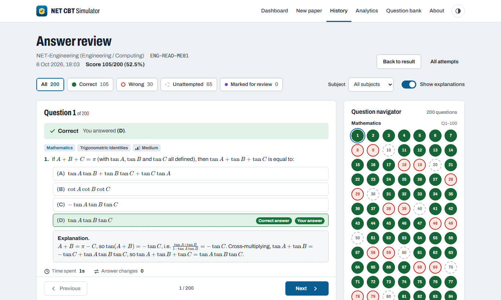
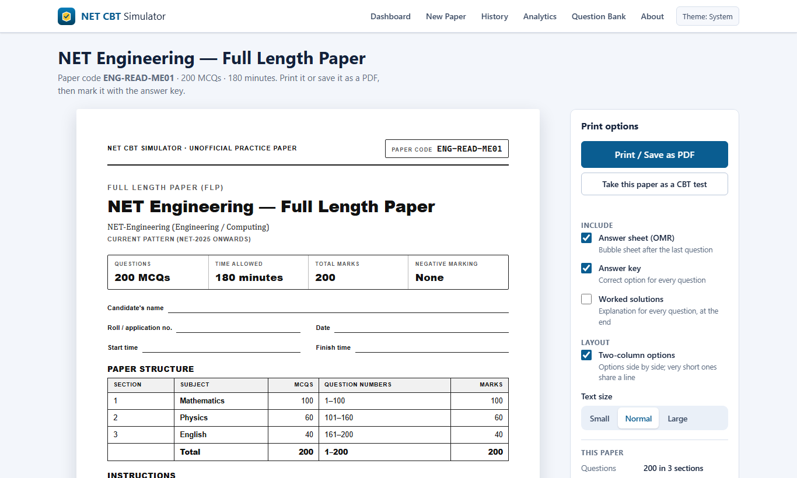
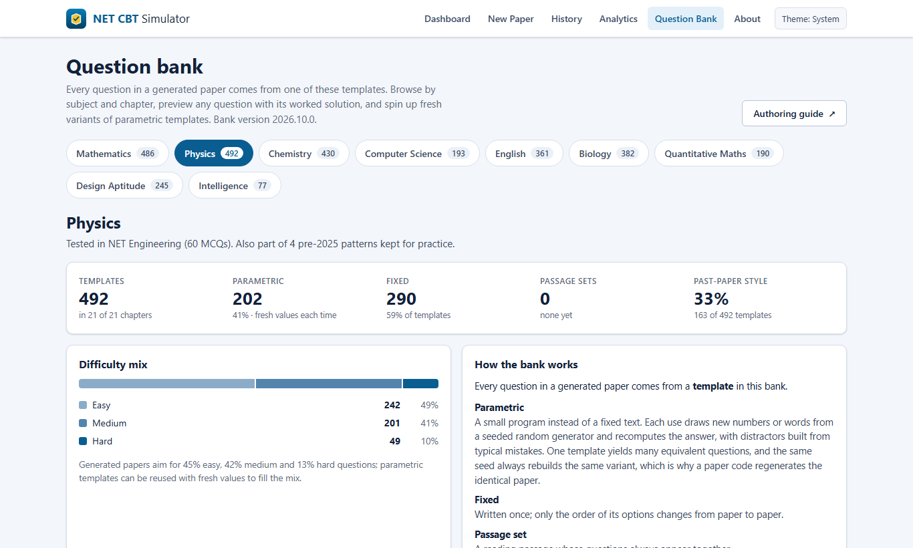
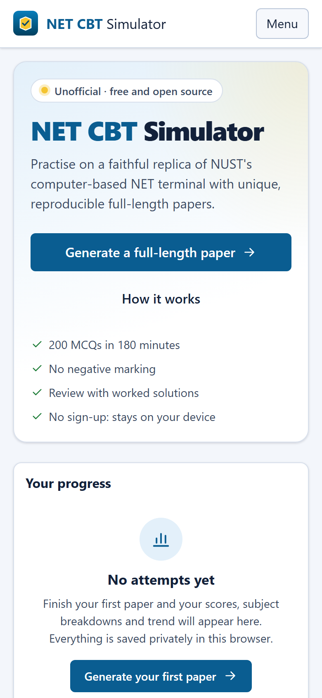

<div align="center">

# NET CBT Simulator

**Practise for the NUST Entry Test on a screen that looks and behaves like the real one, with a fresh
full-length paper every time.**

[**Try it in your browser →**](https://fahad0141.github.io/net-cbt-simulator/)

[](https://github.com/Fahad0141/net-cbt-simulator/actions/workflows/ci.yml)
[](https://github.com/Fahad0141/net-cbt-simulator/actions/workflows/deploy.yml)
[](LICENSE)

</div>



> This is an unofficial, independent project. It isn't made, endorsed or checked by NUST, and it doesn't use any
> NUST logos or official questions. For anything official, go to the
> [NUST admissions website](https://ugadmissions.nust.edu.pk/).

## Why I made this

Most of us prepare for NET with PDFs, books and quiz apps, and then sit down on test day in front of a computer
terminal we've never used. It has its own quirks: your answer only counts if you press **Save**, the clock only shows
minutes, and you move through sections in a particular way. That's a bad time to be learning a new interface.

Mock tests don't help much either. They tend to recycle the same questions, so by your third or fourth attempt you're
remembering answers instead of practising.

So I built two things:

- **A copy of the exam terminal** that behaves like the real one, pieced together from NUST's official CBT sample
  and what candidates have reported about it.
- **A question engine** that puts together a brand-new 200-question paper every time, following the current NET
  pattern, so you never run out of fresh practice.

It's free, it needs no account, and everything stays on your own device.

## What you can do with it

- **Sit a full mock exam**: 200 questions in 180 minutes, with the same layout, buttons and rules as the real
  terminal. That includes Save before Next, Review, Next/Prev Section, the minutes clock and the FINISH
  confirmation. Nothing is lost if you close the tab: it picks up where you left off.
- **Practise more gently** in practice mode, with pause, a question navigator, keyboard shortcuts and instant feedback.
- **See where you stand**: a score report broken down by subject, chapter and difficulty, how you spent your time,
  your weakest chapters (with one click to practise them) and a rough NUST aggregate estimate.
- **Learn from mistakes**: go through every question afterwards with worked solutions.
- **Track progress** across attempts with charts for your scores, chapter mastery and pacing.
- **Print a paper**: an A4 full-length paper with an OMR answer sheet and answer key, or save it as a PDF.
- **Share a paper**: every paper has a short code like `ENG-K7Q2-9XM4`. Anyone who enters the same code gets exactly
  the same paper, which makes it easy to compare scores with friends.
- **Build your own test**: pick subjects, chapters, how many questions and how long.

<details>
<summary><strong>More screenshots</strong></summary>

| Paper generator                                          | Score report                                               |
| -------------------------------------------------------- | ---------------------------------------------------------- |
|  |                |
| **Answer review with worked solutions**                  | **Printable paper with answer key**                        |
|             |    |
| **Question bank browser**                                | **Dashboard on a phone**                                   |
|      |  |

</details>

## Which papers are covered

Every current NET paper (since 2025) is 200 MCQs in 180 minutes, with no negative marking:

| Paper                                  | Sections                                          |
| -------------------------------------- | ------------------------------------------------- |
| NET Engineering                        | Mathematics 100 · Physics 60 · English 40         |
| NET Applied Sciences                   | Biology 100 · Chemistry 60 · English 40           |
| NET Business Studies & Social Sciences | Quantitative Mathematics 100 · English 100        |
| NET Architecture                       | Design Aptitude 100 · Mathematics 60 · English 40 |
| NET Natural Sciences                   | Mathematics 100 · English 100                     |

The older (pre-2025) patterns are there too, if you want extra Chemistry, Computer Science or Intelligence practice.
The sources for all of this are in [docs/EXAM_PATTERN.md](docs/EXAM_PATTERN.md).

## Where the questions come from

The question bank has **2,856 question templates** across 110 chapters of the FSc syllabus (and the NET-specific
subjects). There are two kinds:

- **Generated questions** (about 1,300). Each one is a small program that comes up with new numbers every time and
  works out the answer. Its wrong options are the mistakes students actually make, like a forgotten factor of ½ or a
  sign slip. You'll essentially never see the same one twice.
- **Fixed questions** (about 1,600). These are concept and theory questions written in the style of past NET papers.
  Every one of them is original; nothing is copied from books or academies.

| Subject            | Templates | Generated | Chapters |
| ------------------ | --------: | --------: | -------: |
| Mathematics        |       486 |       310 |       21 |
| Physics            |       492 |       202 |       21 |
| Chemistry          |       430 |       129 |       23 |
| Biology            |       382 |       109 |       13 |
| English            |       361 |        89 |        6 |
| Design Aptitude    |       245 |       142 |        5 |
| Computer Science   |       193 |        87 |       11 |
| Quantitative Maths |       190 |       146 |        6 |
| Intelligence       |        77 |        62 |        4 |

Each paper spreads its questions across chapters roughly the way the real exam does, with a realistic mix of easy,
medium and hard questions.

Getting answers right matters most in something like this. Every template is tested automatically by generating
it many times, and every chapter was checked by solving its questions without looking at the answers first. A final
random check of 162 templates across all subjects found no wrong answers. Still, if you spot a mistake, please
[open an issue](https://github.com/Fahad0141/net-cbt-simulator/issues) with the paper code and question number.
Since codes always rebuild the same paper, I can see exactly what you saw.

## Use it on your phone or PC

- **In the browser**: just open the [website](https://fahad0141.github.io/net-cbt-simulator/). In Chrome or Edge
  you can also choose **Install app** to get it on your home screen or desktop. After the first visit it works
  offline.
- **Android app**: an APK that works offline from the first launch, with Android's print dialog and share sheet.
  Android 6.0 or newer. See [docs/ANDROID.md](docs/ANDROID.md).
- **Windows app**: a normal installer for Windows 10 or 11 that doesn't need admin rights. Windows may warn that
  it "protected your PC" because the installer isn't code-signed; click **More info → Run anyway**. See
  [docs/DESKTOP.md](docs/DESKTOP.md).

The Android and Windows downloads are attached to each [release](https://github.com/Fahad0141/net-cbt-simulator/releases).

## Running it yourself

You'll need [Node.js](https://nodejs.org/) 20 or newer.

```bash
git clone https://github.com/Fahad0141/net-cbt-simulator.git
cd net-cbt-simulator
npm install
npm run dev
```

Then open http://localhost:5173. Some other handy commands:

| Command                               | What it does                                                         |
| ------------------------------------- | -------------------------------------------------------------------- |
| `npm run build` / `npm run preview`   | Build the site into `dist/` and serve it                             |
| `npm test`                            | Run all the tests, including the question-bank checks                |
| `npm run e2e`                         | Browser tests with Playwright (build first)                          |
| `npm run paper -- --type engineering` | Print a full-length paper in the terminal as Markdown                |
| `npm run sample -- physics/waves 3`   | Print a few generated questions from a chapter                       |
| `npm run bank:report`                 | Summarise the question bank into [docs/BANK.md](docs/BANK.md)        |
| `npm run android:sync`                | Prepare the Android app (see [docs/ANDROID.md](docs/ANDROID.md))     |
| `npm run desktop:dist`                | Build the Windows installer (see [docs/DESKTOP.md](docs/DESKTOP.md)) |

The site is static, so it runs on any static host. Every push to `main` deploys it to GitHub Pages automatically.
If you fork the repo, your copy will link to your own fork.

If you want to know how it fits together, start with [docs/ARCHITECTURE.md](docs/ARCHITECTURE.md). Briefly:

```
src/
  engine/     the random generator, question templates, validation and paper assembly
  bank/       the questions, one file per chapter
  config/     exam patterns and syllabus weights
  exam/       the exam session, scoring and saving
  ui/         the CBT terminal and all the pages
  platform/   the bits that differ on Android and Windows
android/      the Android app
desktop/      the Windows app (its own npm package)
docs/         guides and background
```

## Helping out

New questions and corrections are the most useful contributions. Have a look at [CONTRIBUTING.md](CONTRIBUTING.md)
and the [question authoring guide](docs/QUESTION_AUTHORING.md). It explains how to write a question and how to check
it before sending a pull request.

If this helped you prepare, a star on the repo is appreciated, and good luck with your NET!

## License

[MIT](LICENSE). The questions are original and released under the same license.
