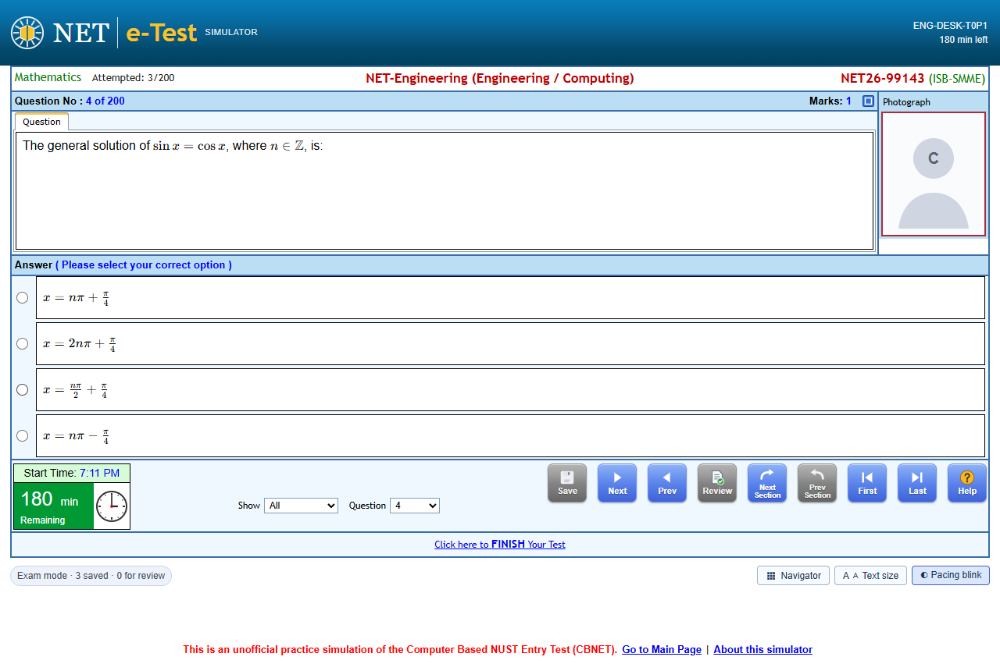

# Windows desktop app

NET CBT Simulator also runs as a Windows desktop app, installed from a `.exe`:

|               | Windows desktop app                               | Website (in a browser)                    |
| ------------- | ------------------------------------------------- | ----------------------------------------- |
| Offline       | Always (everything is in the installer)           | After the first visit                     |
| Printing      | The Windows print dialog (printer or Save as PDF) | The browser's print dialog                |
| Your history  | Stored in your Windows profile (`%APPDATA%`)      | Stored in the browser's site data         |
| Full screen   | F11, without browser bars                         | F11 in most browsers                      |
| Needs hosting | No                                                | Yes (for example the GitHub Pages deploy) |

The app is the same web app, bundled into a desktop window with [Electron](https://www.electronjs.org/). It
needs Windows 10 or 11 (64-bit).



## Install

1. Get `NET-CBT-Simulator-Setup-<version>.exe`: from a GitHub release, from the **Windows desktop app**
   workflow's artifacts, or by [building it](#build-the-installer) yourself.
2. Run it. The installer is not code-signed (there is no code-signing certificate), so Windows SmartScreen
   may show "Windows protected your PC". Choose **More info**, check that the app is **NET CBT Simulator**,
   then choose **Run anyway**. Your browser may also ask you to keep the download.
3. Pick the folder (the default is `%LOCALAPPDATA%\Programs\NET CBT Simulator`) and finish. The app is
   installed for your Windows user only, so administrator rights are not needed. It adds **NET CBT
   Simulator** shortcuts to the desktop and the Start menu.

To update, run the installer of the newer version; your history is kept.

## Where your data is stored

Attempts, the paper in progress, settings and the window size are stored in your Windows profile, in
`%APPDATA%\NET CBT Simulator` (paste this into the File Explorer address bar to open it). Nothing is sent
anywhere: the app has no accounts, no tracking and no server.

Use **Export history** on the History page to save a backup file (the app asks where to save it), and
**Import history** to load one, for example on another computer or from the website.

## Uninstall

Open **Settings → Apps → Installed apps**, find **NET CBT Simulator** and choose **Uninstall**. Uninstalling
keeps your history in `%APPDATA%\NET CBT Simulator`, so a later reinstall finds it again; delete that folder
to remove everything.

## What is different in the desktop app

- **Printing.** **Print / Save as PDF** on the printable paper opens the Windows print dialog. Pick a printer,
  or **Microsoft Print to PDF** to save a PDF.
- **Sharing a paper.** "Copy share link" copies a link to the public website. If the app was built without one
  (`VITE_SITE_URL`, or `VITE_REPO_URL` naming a real GitHub repository with Pages), it copies a message with
  the paper code instead; the code rebuilds exactly the same paper under **Open a paper code** on the
  dashboard. The app's own address (`app://bundle/…`) is never shared.
- **Links to other sites** (GitHub, the official NUST pages) open in your default browser.
- **Closing during a test** asks first. The attempt is saved after every action, so you can close the app
  and resume later; the exam clock keeps running while it is closed, as in the real exam.
- **Keyboard.** Ctrl + C / Ctrl + V, Ctrl + = / Ctrl + - / Ctrl + 0 (zoom) and F11 (full screen) work as in
  a browser. Press Alt to show the menu bar.
- Only one window opens: starting the app again brings the open window to the front.

## Build the installer

Prerequisites: Windows, Node.js 20 or later, and internet access the first time (electron-builder downloads
Electron and NSIS into its cache).

```bash
npm ci                  # the website's dependencies
npm run desktop:install # the desktop app's own dependencies (npm ci in desktop/)
npm run desktop:dist    # build the website, then the installer
```

The installer is written to `dist-desktop/NET-CBT-Simulator-Setup-<version>.exe`, and the unpacked app to
`desktop/release/win-unpacked/` (run `NET CBT Simulator.exe` there to try it without installing).

Other commands:

| Command                 | What it does                                                                      |
| ----------------------- | --------------------------------------------------------------------------------- |
| `npm run desktop:dev`   | Build the website and open it in the desktop shell (with a View → Developer menu) |
| `npm run desktop:test`  | Unit tests of the desktop shell (protocol, link and window-state rules)           |
| `npm run desktop:smoke` | Drive the unpacked app through a full test (see [Testing](#testing))              |

Builds without `VITE_REPO_URL` or `VITE_SITE_URL` share paper codes instead of links (see above). To share
website links, build with, for example, `VITE_REPO_URL=https://github.com/<you>/net-cbt-simulator`.

### Versions

The app's version comes from `version` in the root `package.json`: `npm run desktop:dist` copies it into
`desktop/package.json` before building. Bump it before building a release.

### Icon

`desktop/build/icon.ico` and `icon.png` are rendered from `assets/icon-only.png`. Run `npm --prefix desktop run
icon` (Windows) to regenerate them after changing the logo.

### Code signing

The installer is unsigned. To sign it, set `CSC_LINK` (a `.pfx` file or its base64) and `CSC_KEY_PASSWORD`
before `npm run desktop:dist`; electron-builder then signs the app and the installer, and SmartScreen warnings
fade as the certificate builds reputation.

## How it is built

- `desktop/` is a separate npm package with its own `package.json`, `package-lock.json` and `node_modules`.
  Electron and electron-builder are not dependencies of the website, so `npm ci`, `npm run build`, `dist/` and
  the GitHub Pages deploy are exactly as they were.
- `desktop/scripts/prepare.mjs` copies the website build (`dist/`, without source maps) to `desktop/web/`.
- `desktop/main.cjs` serves `desktop/web/` from the private `app://bundle/` address (a secure, stable origin,
  so the browser storage holding your history survives restarts and updates; `file://` would not). It
  rejects any path outside the bundle and sends a strict Content-Security-Policy: the app loads nothing from
  the network.
- The window runs with context isolation, the renderer sandbox and no Node.js integration. The preload script
  (`desktop/preload.cjs`) only exposes `window.netcbtDesktop = { platform: 'desktop', version }`, which
  `src/platform/desktop.ts` reads to adjust wording and share links and to skip the service worker.
  Printing, export and import use the normal web code (`window.print()`, downloads, file inputs).
- New windows are refused; web links open in the default browser, and other link types are ignored.
- The installer is an NSIS per-user installer configured in `desktop/electron-builder.yml`.

### Electron version

The app uses Electron 41.7.1, the newest Electron whose npm package installs on Node.js 20.18. Later 40.x
and 41.x patches and Electron 42 and later download Electron with `@electron/get` 5, an ES module that needs
Node.js 22.12 or newer. Electron 41 no longer receives security updates. The app only shows its own bundled
pages, with the sandbox on and pop-ups, `<webview>` and remote content blocked, which limits what a Chromium
flaw could reach. Still, move to a supported Electron line once the toolchain moves to Node.js 22: update
`electron` in `desktop/package.json`, run `npm run desktop:install`, then `npm run desktop:dist` and
`npm run desktop:smoke`.

## Testing

`npm run desktop:smoke` drives the unpacked app (`desktop/release/win-unpacked`) with Playwright, using a
temporary profile so your own history is untouched. It checks the `app://` origin and the security settings,
the wording, the clipboard, a full CBT attempt that survives closing and relaunching the app, the "Leave the
test?" question, the single-instance lock, history export and import, the printable paper and external links.
It also refreshes `docs/screenshots/desktop-cbt.png`. Pass a folder to save more screenshots:
`npm run desktop:smoke -- shots`.

## Continuous integration

`.github/workflows/desktop.yml` runs on Windows for version tags (`v*`) and on demand (**Actions → Windows
desktop app → Run workflow**). It runs the desktop unit tests, builds the website and the installer, uploads
the installer as the `windows-installer` artifact, runs the smoke test, and on a version tag attaches the
installer to the GitHub release. It is separate from the website's CI and deploy workflows. CI builds set
`VITE_REPO_URL` to the repository, so their share links point to its GitHub Pages site.
